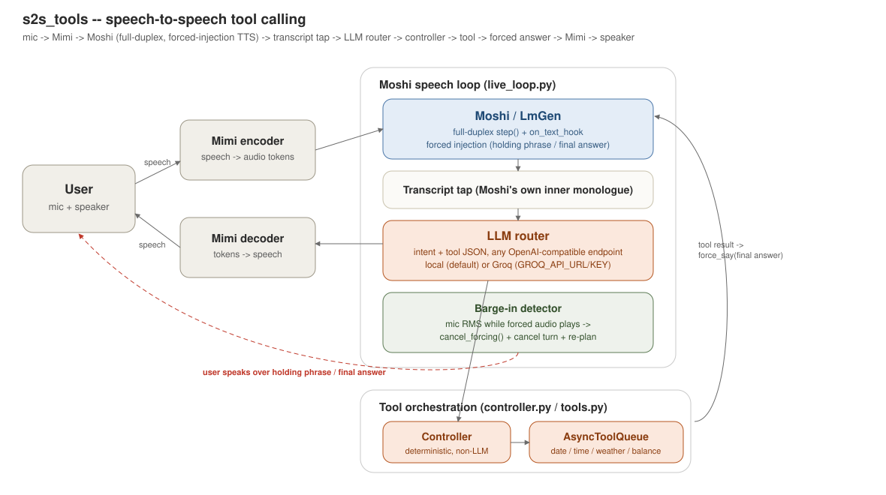

# End-to-End Speech Models with Tool Calling Capabilities

*Author: Jesse-Paul Osemeke*

*Original Paper (Moshi): [arxiv.org/pdf/2410.00037](https://arxiv.org/pdf/2410.00037)*

A live, full-duplex voice agent built on [Moshi](https://arxiv.org/pdf/2410.00037): while it's speaking with you, it taps its own inner-monologue transcript, routes it through an LLM to decide whether a tool call is needed, runs the tool asynchronously, and force-injects a holding phrase and the final answer back into its own speech stream -- without leaving the live audio loop.

## Architecture



- **Mimi encoder/decoder** -- converts speech to/from the audio tokens Moshi operates on.
- **Moshi / LmGen** (`live_loop.py`) -- the full-duplex speech loop. Runs one `step()` per 80ms audio frame. Its own generated text (an inner monologue of what it's about to say) is tapped as a live transcript. `on_text_hook` also lets us force-feed it specific text -- the same teacher-forcing trick the offline TTS model uses internally, adapted here to a live dialogue model that has no built-in word-pacing protocol.
- **Transcript tap + LLM router** (`controller.py`) -- once a stable chunk of Moshi's own monologue is available, it's sent to an LLM that returns structured JSON: intent, whether a tool is needed, which one, and its arguments.
- **Controller + AsyncToolQueue** (`controller.py`, `tools.py`) -- a deterministic (non-LLM) state machine sequences the turn; the actual tool call runs on an async queue so it never blocks the audio loop.
- **Forced injection** -- as soon as a tool call is decided, "Let me check that for you" is forced into Moshi's own voice immediately (before the tool has returned), and once the tool result and the holding phrase have both finished, the real answer is forced in the same way.
- **Barge-in / interruption** -- while forced audio is playing, sustained mic energy cancels the injection and the in-flight tool call, and re-plans from the new speech instead of talking over the user.

See `docs/work_log.md` for the running history of what was built, broken, and fixed, and `docs/arch.drawio`/`docs/arch.png` for the original design sketch this was built from.

## Layout

- `s2s_tools/` -- package source (`controller.py` router/state machine, `tools.py` tool registry, `transcript.py` chunk-stability buffer, `moshi_speech.py` offline TTS injector, `live_loop.py` the full-duplex engine + CLI, `main.py` typed-input CLI).
- `docs/` -- architecture diagrams and work log.
- `tests/` -- routing gold set (`routing_tests.json`).
- `outputs/` -- generated audio/metrics (not committed).

## Setup

```
uv sync
```

The router talks to any OpenAI-compatible chat completions endpoint. Locally, that's usually [`llama-server`](https://github.com/ggml-org/llama.cpp) or similar:

```
llama-server -m /path/to/model.gguf --port 8000 --ctx-size 4096
```

`s2s-live` downloads and loads the Moshi model itself on first run (`kyutai/moshika-mlx-q4` by default -- several GB, cached by `huggingface_hub` after the first pull).

## Usage

```
uv run s2s --text "What's the weather in Lagos?"        # router/controller only, no audio
uv run s2s-live --mode mic                               # live mic + speaker loop
uv run s2s-live --mode wav --wav-in some.wav              # deterministic offline test harness
```

`--mode wav` is the reproducible path used for all the testing in this repo (`--fast` skips real-time pacing; `--pad-seconds` controls how much trailing silence gets appended so Moshi has room to respond and the tool round-trip can complete). Both modes write per-turn latency/naturalness metrics to `outputs/metrics.jsonl` (`--metrics-out` to change the path) and print a live transcript of the conversation as it happens.

Useful `s2s-live` flags: `--quantized {4,8}`, `--hf-repo`, `--barge-in-threshold`/`--barge-in-frames` (tune interruption sensitivity), `--timeline-out` (dump the full event timeline as JSON).

## Router configuration

The router (`LLMRouter` in `controller.py`) isn't tied to any specific model -- it defaults to a local endpoint and only switches to Groq's cloud API if explicitly configured:

| env var | effect |
|---|---|
| *(none set)* | local endpoint, `http://localhost:8000/v1/chat/completions` |
| `GROQ_API_URL` + `GROQ_API_KEY` | routes through Groq instead (`GROQ_API_KEY` is required if `GROQ_API_URL` is set -- raises immediately if missing) |
| `LLM_MODEL` | overrides the model name sent in the request, for either modality |

## Tools

Currently implemented in `tools.py`: `get_current_date`, `get_current_time`, `get_account_balance` (mocked), `get_weather` (live, via Open-Meteo).

## Known limitations

- **Compute speed**: on modest hardware the live loop runs slower than real-time (~9 steps/s measured vs. the ~12.5 steps/s Moshi needs), worse when the router and Moshi share the same GPU/CPU concurrently. The mic input queue is bounded and drops stale frames to stay caught up rather than accumulating lag, but overall responsiveness is hardware-bound.
- **STT accuracy**: Moshi's own transcription of what it hears can be unreliable, especially for place names (e.g. misheard "Abuja" as "Boujab" in testing, causing a legitimate tool failure downstream).
- **One tool call per interruption cycle**: after a tool-triggering turn completes, the session won't react to a *new* tool request until a barge-in resets it -- this guards against a repetition-loop artifact (see below) hammering the router, at the cost of requiring a manual interrupt between back-to-back tool questions.
- **Forced-speech pacing**: injected phrases are paced with a fixed `pad_between_tokens` heuristic (no built-in word-pacing protocol exists for the live dialogue model, unlike the offline TTS model), and can come out slower than natural conversational pace -- `outputs/metrics.jsonl` flags this per turn (`final_answer_pace_natural`).
- **Post-injection repetition**: forced injection leaves Moshi's context ending in text it never organically sampled, which can trigger it to echo itself once natural generation resumes. A short forced-silence "settle" period after each answer mitigates this but isn't a guaranteed fix.
